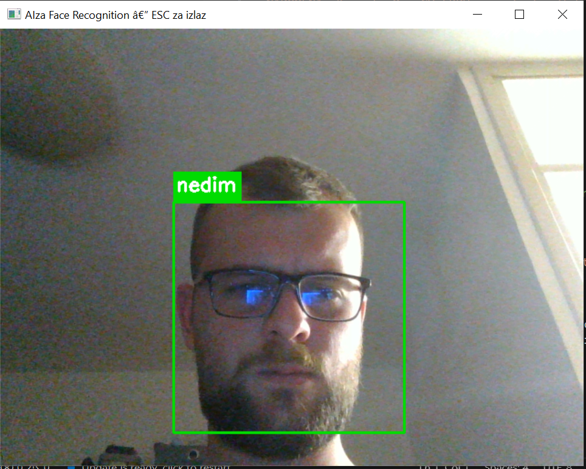
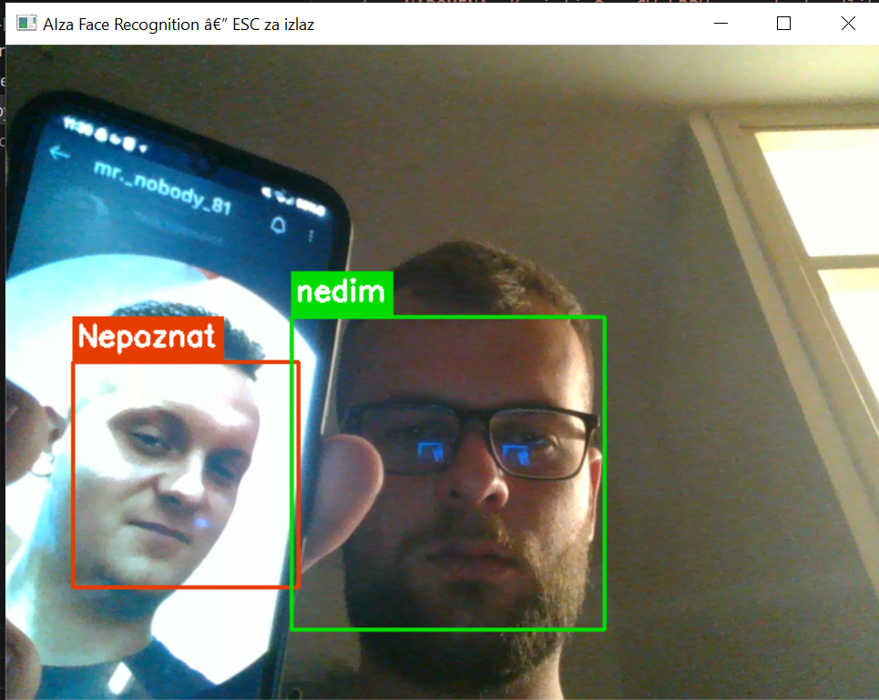

# AI Face Recognition App

## Application Preview

  
  

---

## Description

Python face recognition application built with OpenCV and LBPH algorithm.  
The app trains a model on known faces and performs real-time recognition via webcam, displaying the person's name and confidence score.

---

## Features

- Real-time face detection via webcam
- LBPH-based face recognition (no dlib or Visual Studio Build Tools needed)
- Frontal and profile face detection using Haar Cascades
- Displays recognized name with colored bounding box
- Configurable confidence threshold
- Supports multiple known persons

---

## Tech Stack

- Python
- OpenCV (cv2)
- LBPH Face Recognizer
- Haar Cascade Classifiers
- NumPy
- Pickle

---

## What I Learned

- Building a face recognition pipeline with OpenCV
- Training and loading LBPH models
- Real-time video processing and frame analysis
- Handling frontal and profile face detection
- Managing confidence thresholds for accurate recognition
